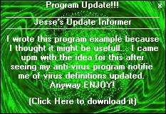



## How to put an update informer in your prog

### Description

Ever used the McAfee.com security center? Well if you have then you know when there is a new virus definition out it shows it in a popup window. This example is like that, kinda... It uses Inet to connect to your webserver and download the latest version release, and if its different from the version of the program then it shows the window that you see in the screenshot. And dont work I put instructions on how to do the whole server and Inet thing :)
 
### More Info
 

             |
---                |---
**Submitted On**   |2003-05-22 21:58:10
**By**             |[Jesse Seidel \(Dr\. Fire\)](https://github.com/Planet-Source-Code/PSCIndex/blob/master/ByAuthor/jesse-seidel-dr-fire.md)
**Level**          |Beginner
**User Rating**    |4.3 (13 globes from 3 users)
**Compatibility**  |VB 6\.0
**Category**       |[Coding Standards](https://github.com/Planet-Source-Code/PSCIndex/blob/master/ByCategory/coding-standards__1-43.md)
**World**          |[Visual Basic](https://github.com/Planet-Source-Code/PSCIndex/blob/master/ByWorld/visual-basic.md)
**Archive File**   |[How\_to\_put1591245232003\.zip](https://github.com/Planet-Source-Code/jesse-seidel-dr-fire-how-to-put-an-update-informer-in-your-prog__1-45660/archive/master.zip)

